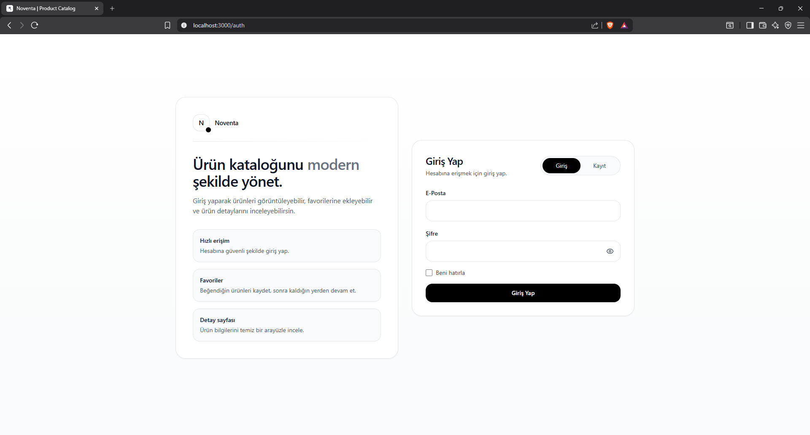
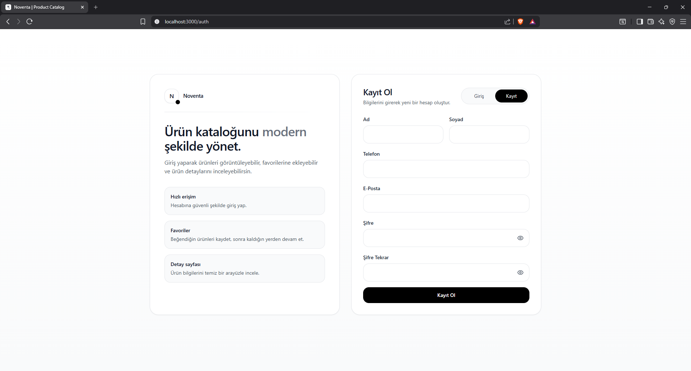
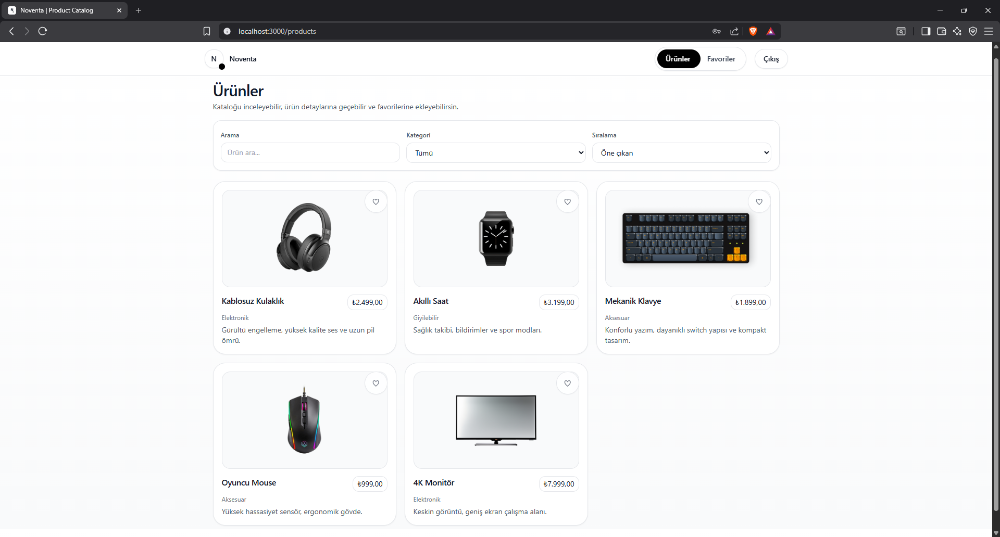
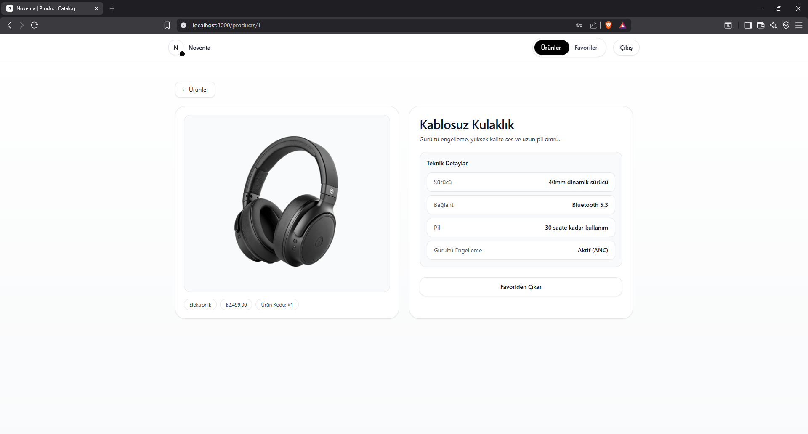
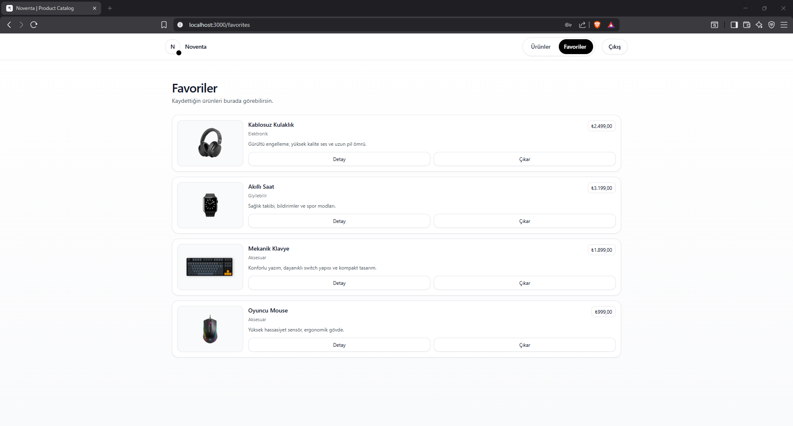

# Noventa — Product Catalog

Bu proje, Piton Technology **“Frontend Ürün Katalog Projesi”** değerlendirme kapsamında geliştirilmiştir.  
Uygulama; **kullanıcı kayıt/giriş akışı**, **ürün listeleme**, **ürün detay** ve **favoriler** akışlarını içerir.

---

## ✨ Özellikler

### 🔐 Kimlik Doğrulama (Auth)
- Login / Register ekranları
- Form validasyonları (e-mail, şifre, ad-soyad, telefon)
- Telefon maskeleme: `+90(505) 888-88-88`
- **“Beni Hatırla”** seçeneği  
  - işaretlenirse token **localStorage** içinde saklanır  
  - işaretlenmezse token **sessionStorage** içinde saklanır
- Register sonrası yönlendirme ve uygulama tekrar açıldığında **login ekranı ile karşılaşma** davranışı

### 🛍️ Ürünler
- Ürün listeleme (**API veya mock fallback**)
- Arama, kategori filtresi, fiyat sıralama
- Ürün kartlarından favoriye ekleme / çıkarma (**küçük kullanıcı bildirimi / toast**)
- Ürün detaya geçiş

### 📌 Ürün Detay
- Ürün bilgileri
- Favoriye ekle / çıkar

### ❤️ Favoriler
- Favori ürünleri listeleme
- Favori yokken “empty state” ekranı

---

## 🧰 Teknolojiler
- **Next.js (App Router)**
- **TypeScript**
- **Redux Toolkit**
- **Tailwind CSS**

---

## 🌐 API Entegrasyonu
Auth ve ürün verisi için aşağıdaki base API kullanılmıştır:

- `https://store-api-dev.piton.com.tr`

**Not:** Ürün endpoint’i hata döndüğü durumlarda kullanıcı deneyimini bozmamak adına **mock verilerle fallback** çalışır.

---

## 🚀 Kurulum

```bash
npm install
npm run dev
```

Uygulama varsayılan olarak şu adreste çalışır:  
`http://localhost:3000`

---

## ⚙️ Environment

Projede `.env.example` örnek dosyası bulunmaktadır.

> Gerekli değişkenler projeye göre düzenlenebilir (örn. API base URL).

---

## 🧭 Kullanım Akışı (Önerilen)

1. `/auth` ekranından **register** veya **login** olun.
2. Login sonrası `/products` sayfasına yönlendirilirsiniz.
3. Ürünleri listeleyebilir, arayabilir, filtreleyebilir ve favorilere ekleyebilirsiniz.
4. Ürün kartına tıklayarak **detay** sayfasına geçebilirsiniz.
5. Favoriler sayfasında favori listenizi görüntüleyebilir ve ürünleri favorilerden çıkarabilirsiniz.

---

## 📸 Ekran Görüntüleri

### Auth


### Register


### Products


### Product Detail


### Favorites


---

## 📌 Notlar
- Token yönetimi **sessionStorage / localStorage** üzerinden yapılır.
- Protected sayfalar (**products, favorites, detail**) auth kontrolü ile korunur.

---

İyi çalışmalar.  
**Görkem Sakartepe**
